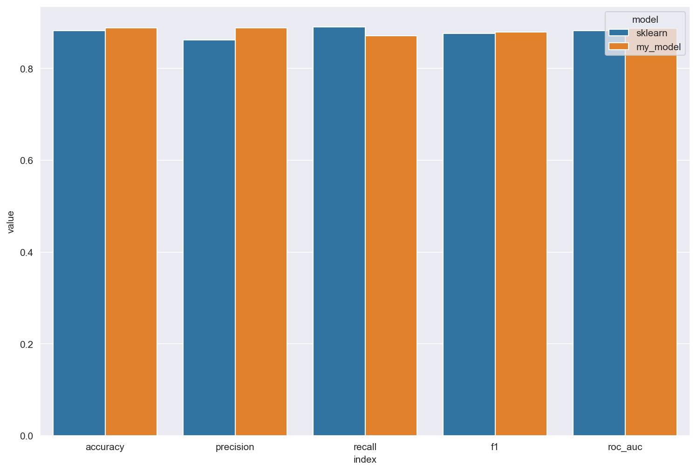
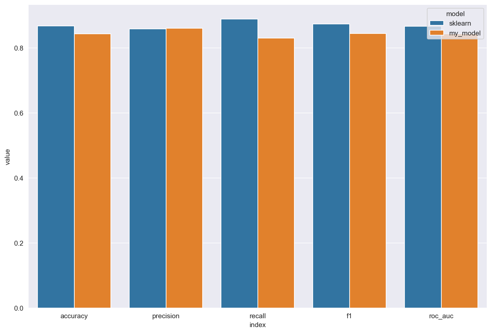
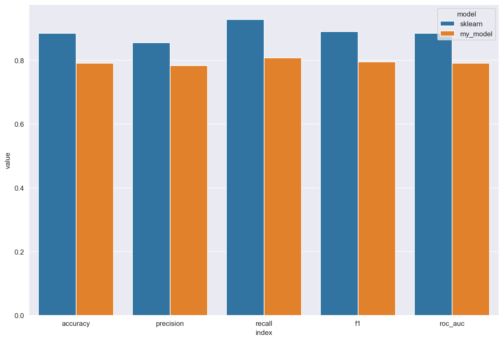
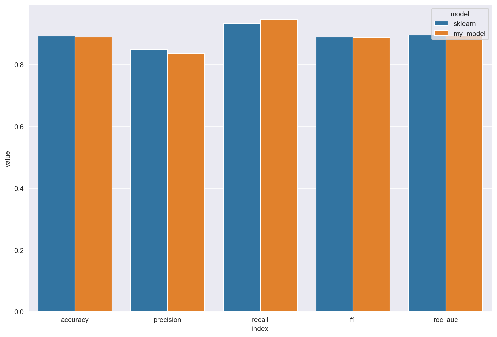

# Проект: Логистическая регрессия с нуля (MyLogReg)

## Введение

Проект реализует логистическую регрессию с нуля на Python без использования готовых библиотек.
Особенности реализации:

* Поддержка L1, L2, ElasticNet регуляризации
* Различные метрики качества (`accuracy`, `precision`, `recall`, `f1`, `roc_auc`)
* Стохастический градиентный спуск с выборкой (`sgd_sample`)
* Возможность динамического learning rate через функцию

**Цель проекта:** изучение алгоритма логистической регрессии и применение его к задаче классификации.
**Актуальность:** логистическая регрессия — базовый метод машинного обучения, применяемый в задачах бинарной классификации.

---

## Теоретическая часть

### Модель логистической регрессии

Формула предсказания вероятности принадлежности к классу 1:

$$
\hat{y}(y=1|x) = \sigma(w_0 + w_1 x_1 + w_2 x_2 + ... + w_n x_n) = \frac{1}{1 + e^{-(Xw)}}
$$

* \$\hat{y}\$ — вероятность принадлежности к классу 1
* \$x\_i\$ — признаки
* \$w\_i\$ — коэффициенты регрессии
* \$\sigma\$ — сигмоида

### Функция потерь (Binary Cross-Entropy)

$$
L = -\frac{1}{m} \sum_{i=1}^{m} \Big( y_i \log(\hat{y}_i) + (1-y_i) \log(1-\hat{y}_i) \Big)
$$

### Градиенты для оптимизации

* Без регуляризации:

$$
\nabla_w = \frac{1}{m}  (\hat{y} - y) X
$$

* L1 (Lasso):

$$
\nabla_w = \frac{1}{m}  (\hat{y} - y) X + \lambda_1 \cdot \text{sign}(w)
$$

* L2 (Ridge):

$$
\nabla_w = \frac{1}{m}  (\hat{y} - y) X + 2 \lambda_2 \cdot w
$$

* ElasticNet:

$$
\nabla_w = \frac{1}{m}  (\hat{y} - y) X + \lambda_1 \cdot \text{sign}(w) + 2 \lambda_2 \cdot w
$$

---

## Реализация (MyLogReg)

Класс `MyLogReg` поддерживает следующие параметры:

| Параметр       | Тип                | Описание                                                              |
| -------------- | ------------------ | --------------------------------------------------------------------- |
| n\_iter        | int                | Количество итераций обучения                                          |
| learning\_rate | float или callable | Скорость обучения (можно функцией)                                    |
| metric         | str                | Метрика качества (`accuracy`, `precision`, `recall`, `f1`, `roc_auc`) |
| reg            | str                | Регуляризация (`l1`, `l2`, `elasticnet`)                              |
| l1\_coef       | float              | Коэффициент L1                                                        |
| l2\_coef       | float              | Коэффициент L2                                                        |
| sgd\_sample    | int/float          | Количество или доля выборки для SGD                                   |
| random\_state  | int                | Фиксатор случайности                                                  |

---

## Сравнение с встроенной реализацией

### Без регуляризации

Модель без регуляризации показывает результаты, сопоставимые со стандартными библиотечными реализациями.

### L2 регуляризация

При использовании L2 регуляризации моя реализация также хорошо себя показывает.

### L1 регуляризация

При L1 регуляризации веса становятся разреженными, что полезно при отборе признаков.

### ElasticNet

Комбинация L1 и L2 даёт баланс между устойчивостью и разреженностью.

### Подведение итогов сравнение
При просмотре метрик моей и встроенной релизаций, я убедился, что моя реализация написана хорошо, так как на метриках расхождений почти нет, что говорит о хорошей работе модели

---

## Сравнение SGD и полного градиентного спуска

* **Полный градиентный спуск (GD):** быстрее на маленьких данных, сходимость гладкая.
* **Стохастический градиентный спуск (SGD):** подходит для больших данных, добавляет шум, снижает переобучение.

| Характеристика               | Градиентный спуск (GD)                     | Стохастический градиентный спуск (SGD)      |
| ---------------------------- | ------------------------------------------ | ------------------------------------------- |
| Работа с данными             | Использует весь датасет на каждой итерации | Использует случайный объект или мини-батч   |
| Скорость на маленьких данных | Быстрая сходимость                         | Медленнее из-за случайных выборок           |
| Скорость на больших данных   | Очень медленно                             | Быстрее, так как обрабатывает подвыборки    |
| Сходимость                   | Гладкая, предсказуемая                     | Колеблющаяся, но быстрее достигает минимума |
| Риск переобучения            | Выше                                       | Ниже благодаря шуму при обучении            |
| Применимость                 | Малые и средние наборы данных              | Большие наборы данных, онлайн-обучение      |

---
